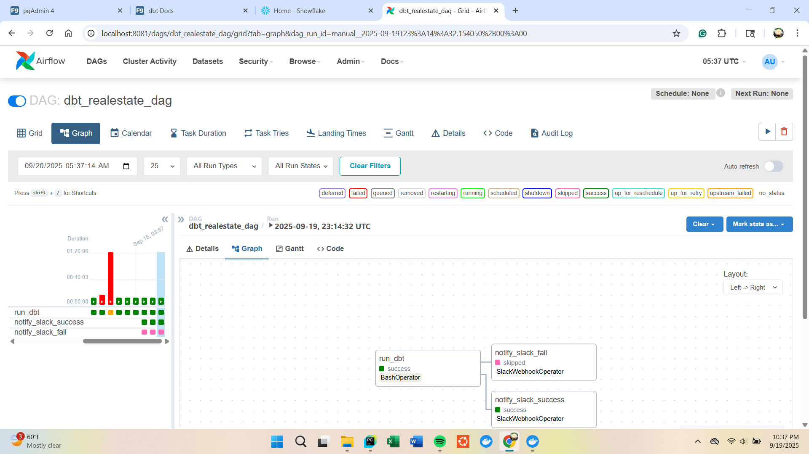
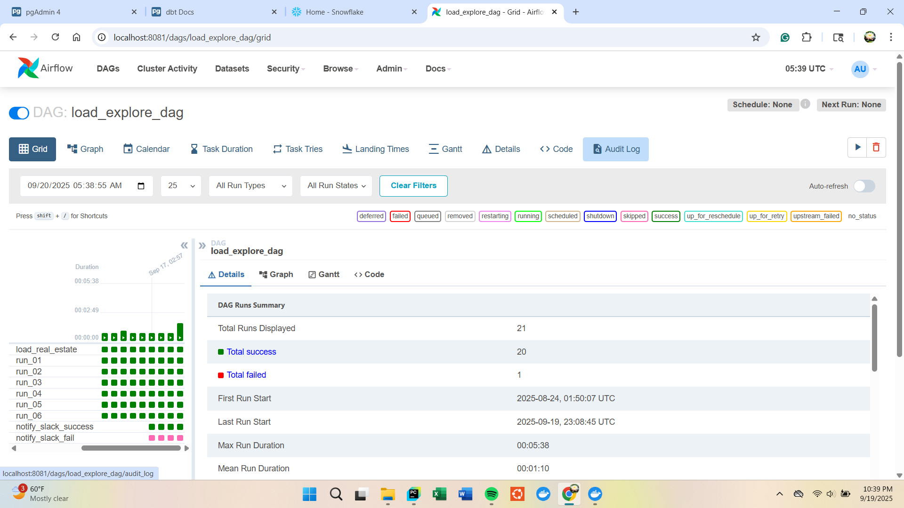
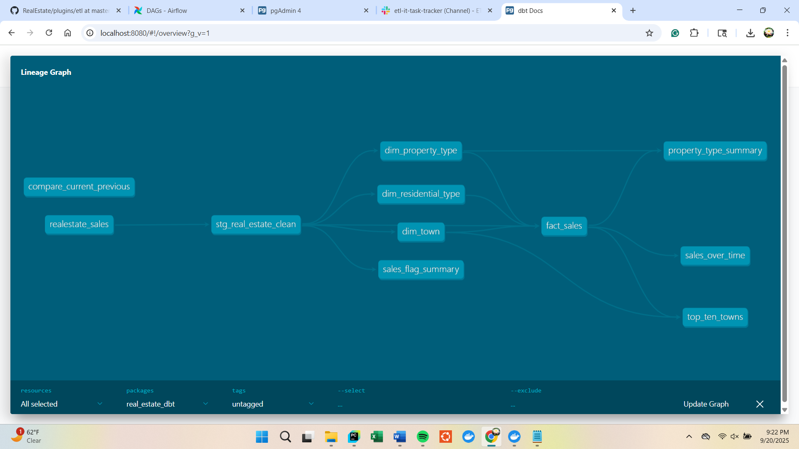
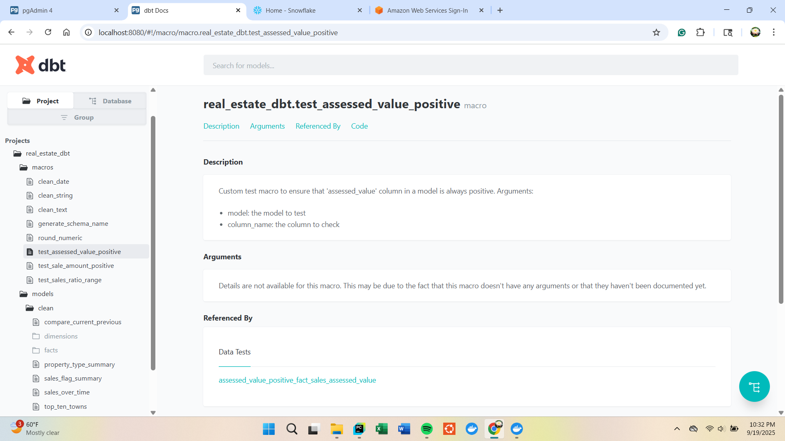
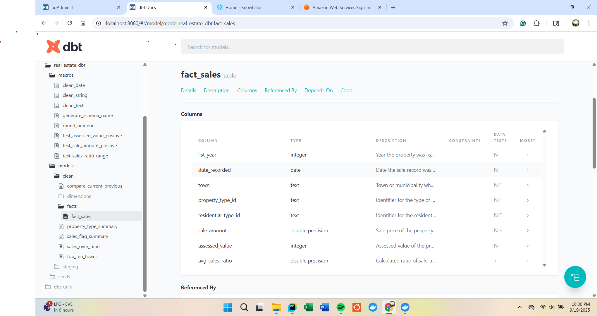
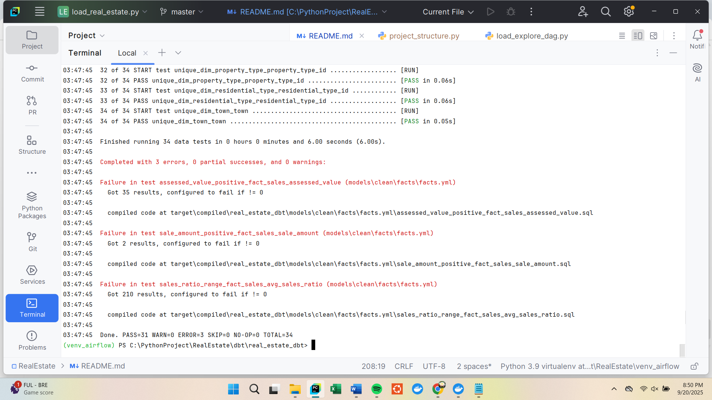

# Real Estate Sales ETL Pipeline (Connecticut, 2001–2022)

## Project Summary
End-to-end SQL/dbt ETL pipeline on ~1.1M rows of CT property sales.

Phase I: SQL scripts for exploration, cleaning, profiling, and staging.
Phase II: dbt models for transformations, fact/dimension tables, automated tests, and documentation.
*** Python only for CSV ingestion and Airflow DAG orchestration. ***

### Data Source
CT Office of Policy and Management
Property sales ≥ $2,000 (2001–2022), covering town, address, sale date, property type, sale/assessed value, remarks.
Annual Grand List reporting (Oct → Sep).

### Tech Stack

Airflow: ETL orchestration + Slack notifications
Postgres: Local data warehouse for raw/staging/analytics
dbt: Transformations, testing, documentation, star-schema modeling
Python: CSV ingestion and EDA
Slack: DAG success/failure alerts

### ETL Overview

Phase I SQL: 6 sequential scripts → exploration, column standardization, staging, profiling, cleaning, EDA
Phase II dbt: Build star schema: fact_sales + dim_town, dim_property_type, dim_residential_type

Data Quality: Not null, unique, accepted values, relationships, and custom numeric tests

## Documentation and Snapshots
Project artifacts are stored under the `docs` and `dbt` directories:

- **docs/airflow_screenshots** → Airflow DAG runs and orchestration flow:
### Figure 1: RealEstate dbt build DAG – Graph View
  - 
### Figure 2: RealEstate SQL ETL DAG (Load and Explore Data) - Graph View
  - 

- **docs/dbt_docs_screenshots** → dbt docs UI, lineage, test results, and ER diagram of the star schema:
### Figure 1: Entity-Relationship Diagram
  - 
### Figure 2: dbt Custom Test Overview
  - 
### Figure 3: dbt Fact Sales Model
  - 
### Figure 4: dbt Test Run – Set 1
  - 
### Figure 5: dbt Test Run – Set 2
  - 

- **dbt/real_estate_dbt/snapshots** → dbt snapshot CSVs for marts (historical tracking of fact and dimension tables):
 - [Staging Real Estate Snapshot CSV](https://github.com/masabai/RealEstate/blob/master/dbt/real_estate_dbt/snapshots/dbt/staging_real_estate.csv)
 - [Property Type Summary Snapshot CSV](https://github.com/masabai/RealEstate/blob/master/dbt/real_estate_dbt/snapshots/dbt/property_type_summary.csv)
 - [Fact Sales Snapshot CSV](https://github.com/masabai/RealEstate/blob/master/dbt/real_estate_dbt/snapshots/dbt/fact_sales.csv)
 - [Dim Property Type Snapshot CSV](https://github.com/masabai/RealEstate/blob/master/dbt/real_estate_dbt/snapshots/dbt/dim_property_type.csv)
