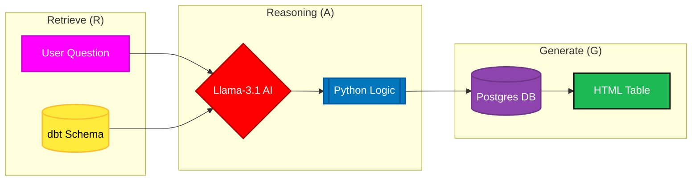
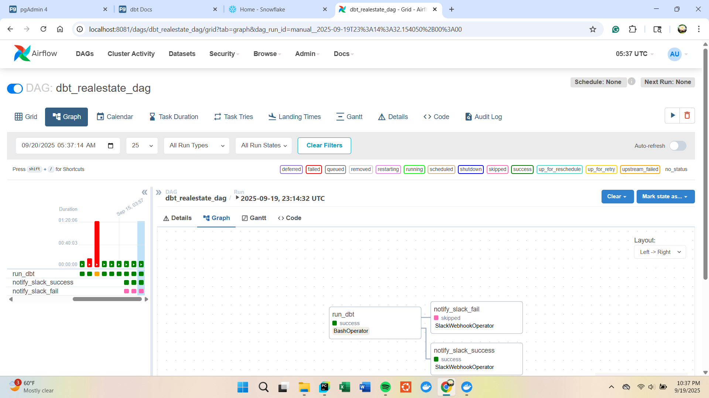
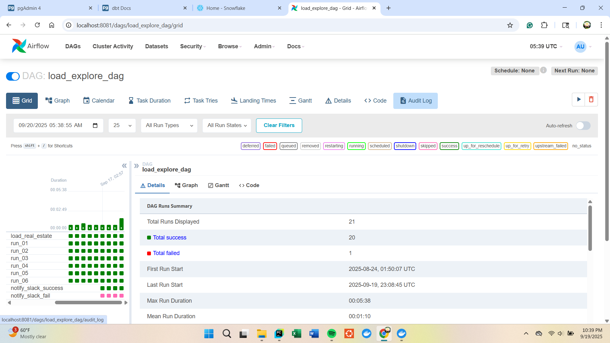
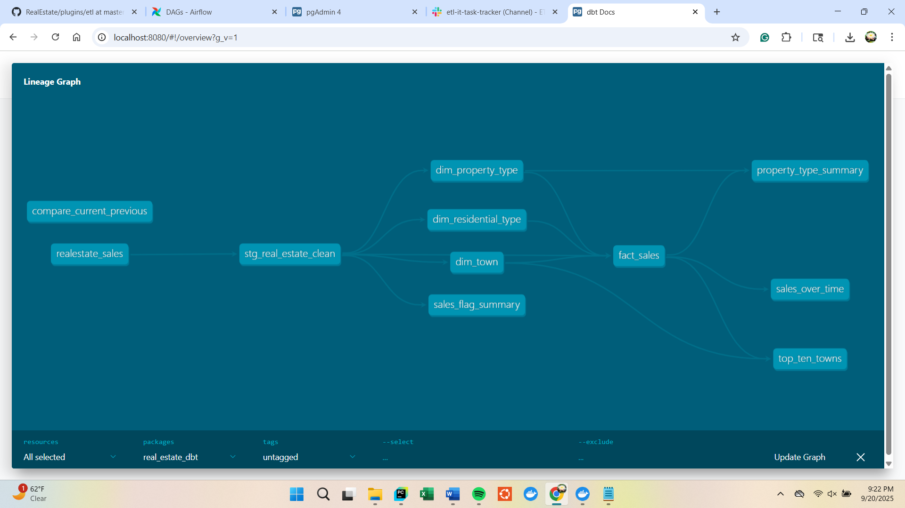
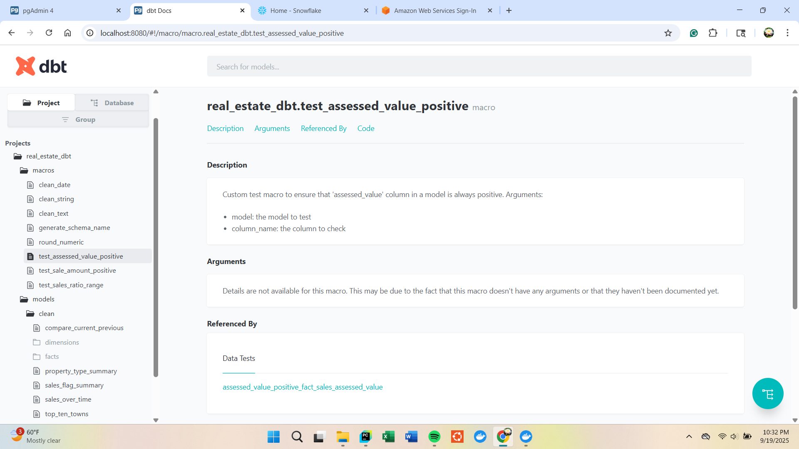
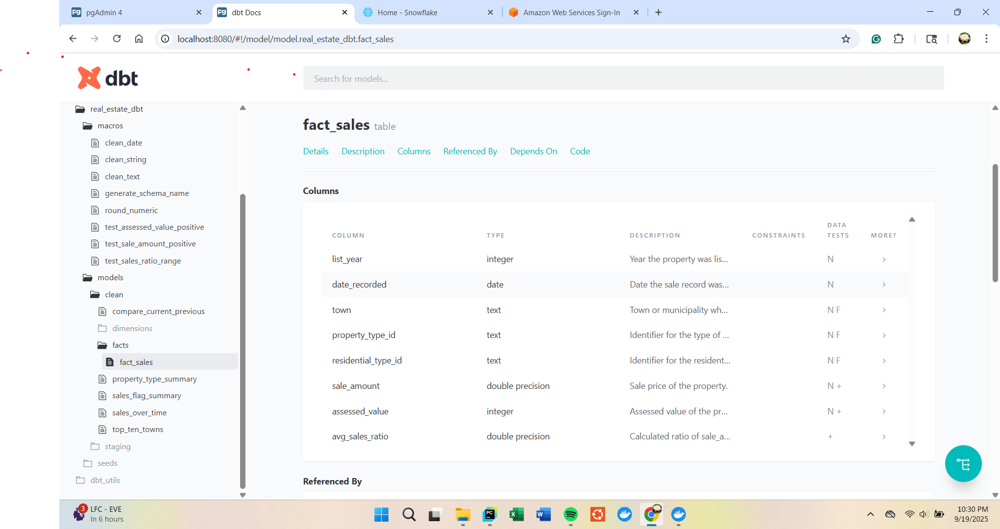
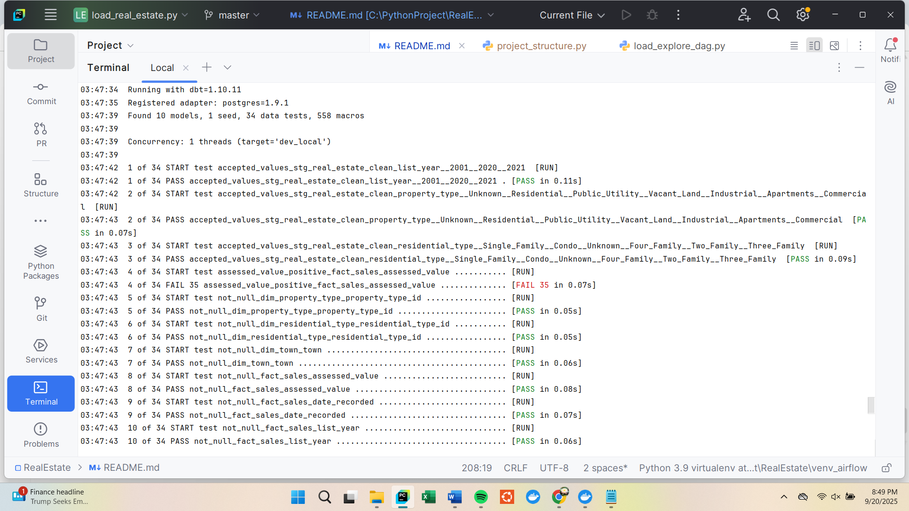
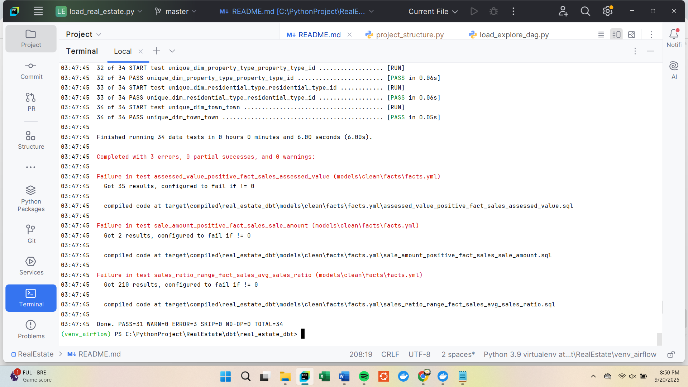

# Real Estate Sales ETL Pipeline (Connecticut, 2001–2022)

## Project Summary
End-to-end SQL/dbt ETL pipeline on ~1.1M rows of CT property sales.

**Phase I:** SQL scripts for exploration, cleaning, profiling, and staging.

**Phase II:** dbt models for transformations, fact/dimension tables, automated tests, and documentation.

**Phase III:** AI Reasoning Engine (Text-to-SQL)
An intelligent interface that allows users to query the clean star-schema using natural language. This is a **Metadata-Injected RAG** pipeline (Retrieval-Augmented Generation) that avoids the "fuzzy" matching of Vector DBs in favor of 100% schema accuracy.

## AI Architecture
*   **Reasoning Model:** Llama-3.1-8b-instant (via Groq/FastAPI)
*   **RAG Strategy:** Deterministic Context Injection (Schema + SQL Rules)
*   **Constraints:** Temperature=0 for consistent, executable PostgreSQL generation
*   **Features:** Automated rounding for aggregates, direct town/property type filtering, and absolute integer counts.

### System Architecture

```mermaid
graph LR
    subgraph "Retrieve (R)"
        A[User Question]
        B[(dbt Schema)]
    end

    subgraph "Reasoning (A)"
        C{Llama-3.1 AI}
        D[[Python Logic]]
    end

    subgraph "Generate (G)"
        E[(Postgres DB)]
        F[HTML Table]
    end

    %% Flow Connections
    A --> C
    B --> C
    C --> D
    D --> E
    E --> F

    %% Professional High-Contrast Palette (Darker fills, white text)
    style A fill:#ff00ff,stroke:#cc00cc,stroke-width:2px,color:#fff 
    style B fill:#FFEB3B,stroke:#FBC02D,stroke-width:2px,color:#000  
    style C fill:#ff0000,stroke:#b30000,stroke-width:2px,color:#fff 
    style D fill:#0277bd,stroke:#01579b,stroke-width:2px,color:#fff
    style E fill:#8e44ad,stroke:#71368a,stroke-width:2px,color:#fff
    style F fill:#1DB954,stroke:#191414,stroke-width:2px,color:#fff
```

#### *** Python for CSV ingestion, Airflow orchestration, and the AI Reasoning Engine (FastAPI) ***

### Data Source
CT Office of Policy and Management
Property sales ≥ $2,000 (2001–2022), covering town, address, sale date, property type, sale/assessed value, and remarks.
Annual Grand List reporting (Oct → Sep).

### Tech Stack

**Docker:** Containerized environment for Airflow, Postgres, and dbt, ensuring reproducible and isolated pipelines

**Airflow:** ETL orchestration + Slack notifications

**Postgres:** Local data warehouse for raw/staging/analytics

**dbt:** Transformations, testing, documentation, star-schema modeling

**Python:** CSV ingestion and EDA

**Slack:** DAG success/failure alerts

**FastAPI:** High-performance web framework for the AI Reasoning Engine and HTML Results UI.

**Llama-3.1:** LLM "Brain" used for deterministic Text-to-SQL translation (Temperature=0).

**Groq:** Fast inference engine to ensure near-zero latency for the RAG pipeline.

### ETL Overview

**Phase I SQL:** 6 sequential scripts → exploration, column standardization, staging, profiling, cleaning, EDA

**Phase II dbt:** Build star schema: fact_sales + dim_town, dim_property_type, dim_residential_type

Data Quality: Not null, unique, accepted values, relationships, and custom numeric tests

## Documentation and Snapshots
Project artifacts are stored under the `docs` and `dbt` directories:

- **docs/airflow_screenshots** → Airflow DAG runs and orchestration flow:
  
### Figure 1: RealEstate dbt build DAG – Graph View
  - 
### Figure 2: RealEstate SQL ETL DAG (Load and Explore Data) - Graph View
  - 
    

- **docs/dbt_docs_screenshots** → dbt docs UI, lineage, test results, and ER diagram of the star schema:
### Figure 1: Entity-Relationship Diagram
  - 
### Figure 2: dbt Custom Test Overview
  - 
### Figure 3: dbt Fact Sales Model
  - 
### Figure 4: dbt Test Run – Set 1
  - 
### Figure 5: dbt Test Run – Set 2
  - 

- **dbt/real_estate_dbt/snapshots** → dbt snapshot CSVs for marts (historical tracking of fact and dimension tables):
  
 - [Staging Real Estate Snapshot CSV](https://github.com/masabai/RealEstate/blob/master/dbt/real_estate_dbt/snapshots/dbt/staging_real_estate.csv)
 - [Property Type Summary Snapshot CSV](https://github.com/masabai/RealEstate/blob/master/dbt/real_estate_dbt/snapshots/dbt/property_type_summary.csv)
 - [Fact Sales Snapshot CSV](https://github.com/masabai/RealEstate/blob/master/dbt/real_estate_dbt/snapshots/dbt/fact_sales.csv)
 - [Dim Property Type Snapshot CSV](https://github.com/masabai/RealEstate/blob/master/dbt/real_estate_dbt/snapshots/dbt/dim_property_type.csv)
