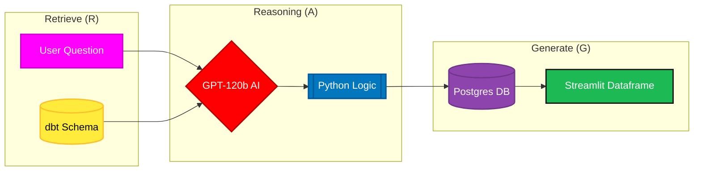

# Real Estate Sales ELT Pipeline (Connecticut, 2001–2022)

## Project Summary
End-to-end SQL/dbt ELT pipeline on ~1.1M rows of CT property sales.

**Phase I (ELT):** Python-based ingestion to Raw schema, followed by SQL scripts for profiling and Staging.

**Phase II (dbt):** dbt models for transformations, fact/dimension tables, automated tests, and documentation.

**Phase III (Query Interface):** Natural Language Querying (Text-to-SQL) and SQL Interface
This phase allows users to query the clean star-schema of property data using natural language (plain English)
or SQL, with a built-in "Auto-repair" logic for sql syntax errors.

**Model & Execution:** Uses GPT-120b (via Groq) as the reasoning engine to interpret user intent and generate
PostgreSQL code.

**Metadata-Injected RAG:** Instead of vector similarity search, the system injects
explicit database schema metadata into the prompt. This guarantees correct table and column selection.

**Strict Logic Mode:** The model is locked at Temperature 0 to eliminate "creativity." 
This ensures the SQL generated is consistent, repeatable, and won't hallucinate non-existent data.

**Auto-Repair SQL:** If the database returns a syntax error (e.g., lmit instead of LIMIT), the system 
automatically identifies the error and repairs the code before returning the final result.

**Query Observability (Snowflake-Style):** Every query—whether generated by AI or typed by a human—is logged 
in the ai_query_logs table. This provides a full audit trail of user questions and execution timestamps.

```mermaid
graph LR
    subgraph "Retrieve (R)"
        A[User Question]
        B[(dbt Schema)]
    end

    subgraph "Reasoning (A)"
        C{GPT-120b AI}
        D[[Python Logic]]
    end

    subgraph "Generate (G)"
        E[(Postgres DB)]
        F[Streamlit Dataframe]
    end

    %% Flow Connections
    A --> C
    B --> C
    C --> D
    D --> E
    E --> F

    %% Professional High-Contrast Palette (Darker fills, white text)
    style A fill:#ff00ff,stroke:#cc00cc,stroke-width:2px,color:#fff 
    style B fill:#FFEB3B,stroke:#FBC02D,stroke-width:2px,color:#000  
    style C fill:#ff0000,stroke:#b30000,stroke-width:2px,color:#fff 
    style D fill:#0277bd,stroke:#01579b,stroke-width:2px,color:#fff
    style E fill:#8e44ad,stroke:#71368a,stroke-width:2px,color:#fff
    style F fill:#1DB954,stroke:#191414,stroke-width:2px,color:#fff
```

### Pipeline Architecture

1. Python ingests raw CSV files into PostgreSQL (raw schema)

2. SQL scripts perform data profiling and staging

3. dbt transforms staging tables into a star schema

4. Airflow orchestrates the ELT pipeline

5. Streamlit provides a query interface (NL → SQL)

### Dataset: Connecticut Real Estate Sales (2001–2022)
~1.1M transaction records.

### Tech Stack

**Docker:** Containerized environment for Airflow, Postgres, and dbt, ensuring reproducible and isolated pipelines

**Airflow:** ETL orchestration + Slack notifications

**Postgres:** Local data warehouse for raw/staging/analytics

**dbt:** Transformations, testing, documentation, star-schema modeling

**Python:** CSV ingestion and EDA

**Slack:** DAG success/failure alerts

**Streamlit:** Full-stack framework for the AI Reasoning Engine, SQL execution, and results UI.

**openai/gpt-oss-120b:** LLM "Query Engine" used for deterministic Text-to-SQL translation (Temperature=0).

**Groq:** Fast inference engine to ensure near-zero latency for the RAG pipeline.

#### Try These Questions

*   **Aggregations**: "How many residential properties sold in 2021?"
*   **Rankings**: "Top 10 most expensive towns by average sale price in 2022?"
*   **Filtering**: "Which property type had the highest average sale price in Hartford?"
*   **Market Analysis**: "What is the average sale-to-assessed ratio across all towns?"

---

#### Technical References
*   **Architectural Logic**: [RAG on Structured Data: Text-to-SQL vs. Pandas Querying](https://www.leewayhertz.com)
*   **Vectorless RAG**: [Introduction to RAG without a Vector Database](https://www.restack.io)
*   **Inference Engine**: [High-Speed SQL-RAG with Groq](https://dev.to)
*   **API Framework**: [Building RAG Applications with FastAPI](https://www.restack.io)
  
### Figure 1: RealEstate dbt build DAG – Graph View
  - 
### Figure 2: RealEstate SQL ETL DAG (Load and Explore Data) - Graph View
  - 
    

- **docs/dbt_docs_screenshots** → dbt docs UI, lineage, test results, and ER diagram of the star schema:
### Figure 1: Entity-Relationship Diagram
  - 
### Figure 2: dbt Custom Test Overview
  - 
### Figure 3: dbt Fact Sales Model
  - 
### Figure 4: dbt Test Run – Set 1
  - 
### Figure 5: dbt Test Run – Set 2
  - 

- **dbt/real_estate_dbt/snapshots** → dbt snapshot CSVs for marts (historical tracking of fact and dimension tables):
  
 - [Staging Real Estate Snapshot CSV](https://github.com/masabai/RealEstate/blob/master/dbt/real_estate_dbt/snapshots/dbt/staging_real_estate.csv)
 - [Property Type Summary Snapshot CSV](https://github.com/masabai/RealEstate/blob/master/dbt/real_estate_dbt/snapshots/dbt/property_type_summary.csv)
 - [Fact Sales Snapshot CSV](https://github.com/masabai/RealEstate/blob/master/dbt/real_estate_dbt/snapshots/dbt/fact_sales.csv)
 - [Dim Property Type Snapshot CSV](https://github.com/masabai/RealEstate/blob/master/dbt/real_estate_dbt/snapshots/dbt/dim_property_type.csv)
