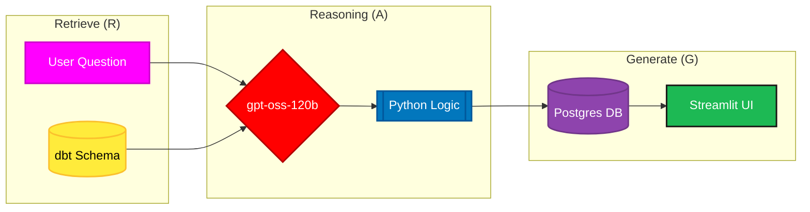
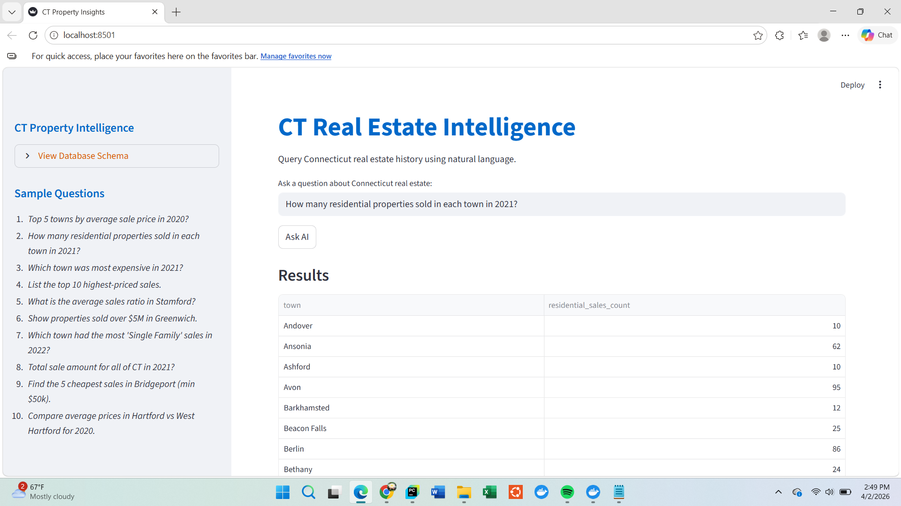
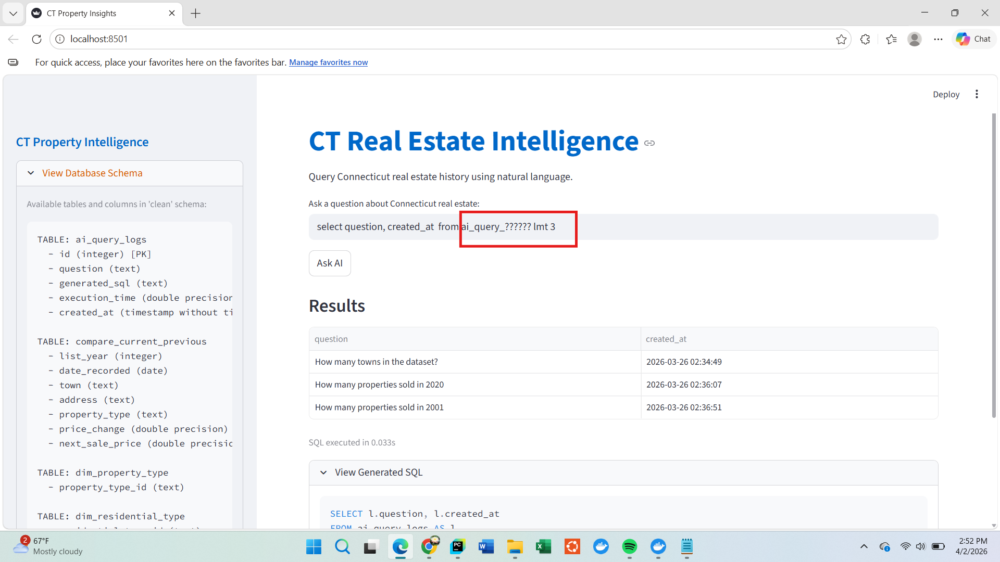
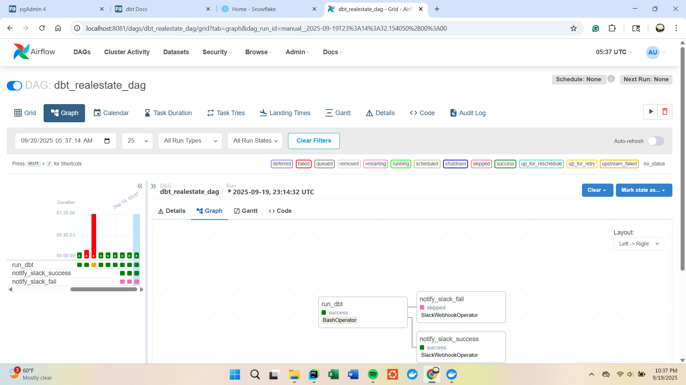
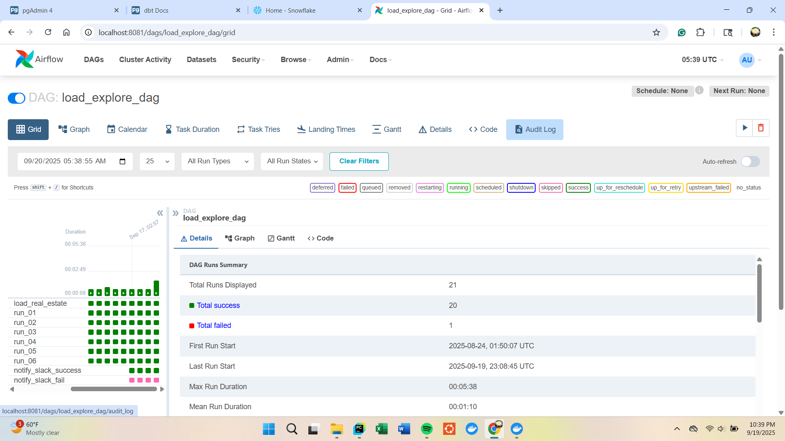
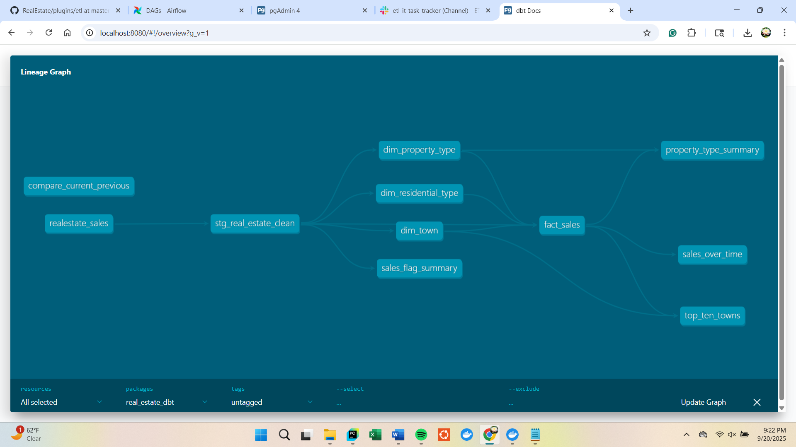
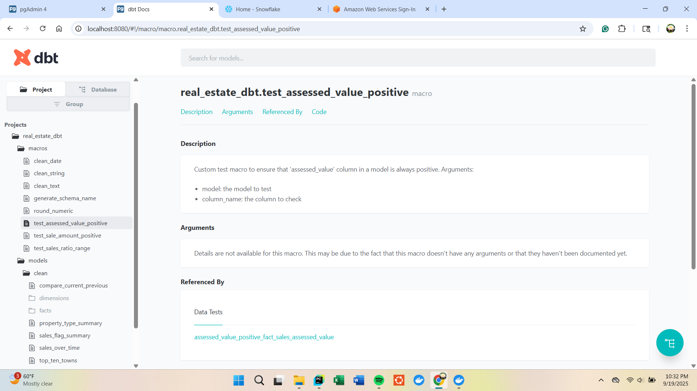
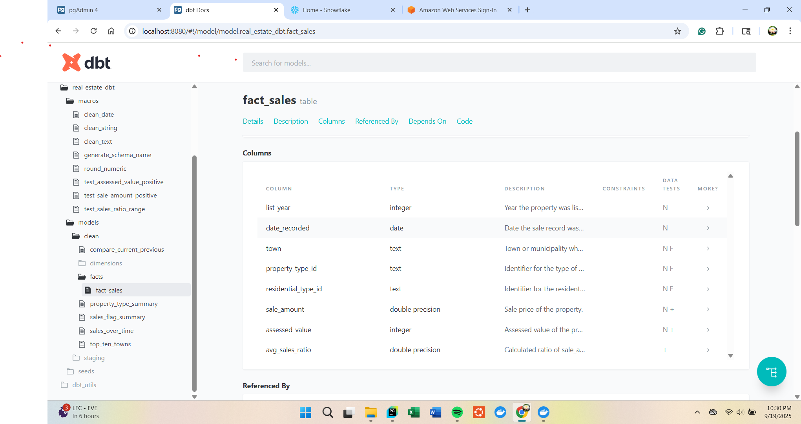
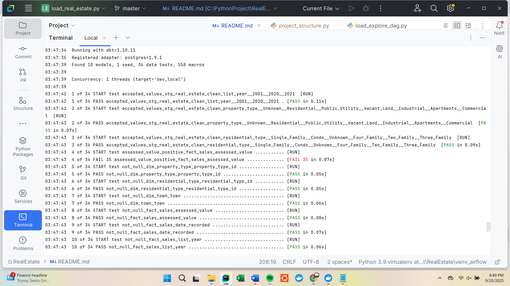
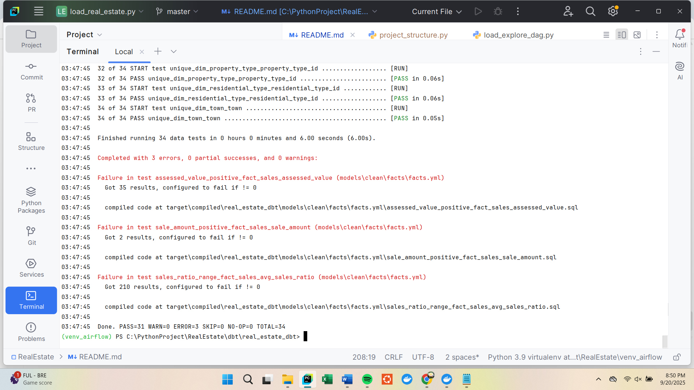

# Real Estate Sales ELT Pipeline (Connecticut, 2001–2022)

## Project Summary
End-to-end SQL/dbt ELT pipeline on ~1.1M rows of CT property sales.

**Phase I (ELT):** Python-based ingestion to Raw schema, followed by SQL scripts for profiling and Staging.

**Phase II (dbt):** dbt models for transformations, fact/dimension tables, automated tests, and documentation.

**Phase III (SQL Query Interface):** Natural language to SQL reasoning engine  

This phase allows users to query the clean star-schema of property data using plain English or SQL,  
with built-in auto-repair logic for syntax errors.

## AI Architecture
*   **Reasoning Model:** openai/gpt-oss-120b (via Groq)
*   **Context Strategy:** Deterministic Context Injection (Schema + SQL Rules)
*   **Constraints:** Temperature=0 for consistent, executable PostgreSQL generation
*   **Features:** Automated rounding for aggregates, direct town/property type filtering, and absolute integer counts.

## QA Coverage
Verified functionality with 30+ test queries across aggregations, comparisons, time-series, filters,
and metrics. A quick internal script runs all questions and records any failed queries (empty results or execution errors).
Sample questions are also included in the Streamlit sidebar for demo purposes.

```mermaid
graph LR
    subgraph "Retrieve (R)"
        A[User Question]
        B[(dbt Schema)]
    end

    subgraph "Reasoning (A)"
        C{gpt-oss-120b}
        D[[Python Logic]]
    end

    subgraph "Generate (G)"
        E[(Postgres DB)]
        F[Streamlit UI]
    end

    %% Flow Connections
    A --> C
    B --> C
    C --> D
    D --> E
    E --> F

    %% Professional High-Contrast Palette (Darker fills, white text)
    style A fill:#ff00ff,stroke:#cc00cc,stroke-width:2px,color:#fff 
    style B fill:#FFEB3B,stroke:#FBC02D,stroke-width:2px,color:#000  
    style C fill:#ff0000,stroke:#b30000,stroke-width:2px,color:#fff 
    style D fill:#0277bd,stroke:#01579b,stroke-width:2px,color:#fff
    style E fill:#8e44ad,stroke:#71368a,stroke-width:2px,color:#fff
    style F fill:#1DB954,stroke:#191414,stroke-width:2px,color:#fff
```

### Tech Stack

**Docker:** Containerized environment for Airflow, Postgres, and dbt, ensuring reproducible and isolated pipelines

**Airflow:** ETL orchestration + Slack notifications

**Postgres:** Local data warehouse for raw/staging/analytics

**dbt:** Transformations, testing, documentation, star-schema modeling

**Python:** CSV ingestion and EDA

**Slack:** DAG success/failure alerts

**Streamlit:** SQL Query Interface & results visualization UI.

**openai/gpt-oss-120b:** LLM model used for deterministic Text-to-SQL translation (Temperature=0).

**Groq:** Fast inference engine to ensure near-zero latency for the RAG pipeline.

  
### Figure 1: RealEstate Text-to-SQL Natural Language Qestion
  - 
### Figure 2: RealEstate Text-to-SQL Auto Repair SQL syntax
  - 

  
### Figure 1: RealEstate dbt build DAG – Graph View
  - 
### Figure 2: RealEstate SQL ETL DAG (Load and Explore Data) - Graph View
  - 
    

- **docs/dbt_docs_screenshots** → dbt docs UI, lineage, test results, and ER diagram of the star schema:
### Figure 1: Entity-Relationship Diagram
  - 
### Figure 2: dbt Custom Test Overview
  - 
### Figure 3: dbt Fact Sales Model
  - 
### Figure 4: dbt Test Run – Set 1
  - 
### Figure 5: dbt Test Run – Set 2
  - 

- **dbt/real_estate_dbt/snapshots** → dbt snapshot CSVs for marts (historical tracking of fact and dimension tables):
  
 - [Staging Real Estate Snapshot CSV](https://github.com/masabai/RealEstate/blob/master/dbt/real_estate_dbt/snapshots/dbt/staging_real_estate.csv)
 - [Property Type Summary Snapshot CSV](https://github.com/masabai/RealEstate/blob/master/dbt/real_estate_dbt/snapshots/dbt/property_type_summary.csv)
 - [Fact Sales Snapshot CSV](https://github.com/masabai/RealEstate/blob/master/dbt/real_estate_dbt/snapshots/dbt/fact_sales.csv)
 - [Dim Property Type Snapshot CSV](https://github.com/masabai/RealEstate/blob/master/dbt/real_estate_dbt/snapshots/dbt/dim_property_type.csv)
